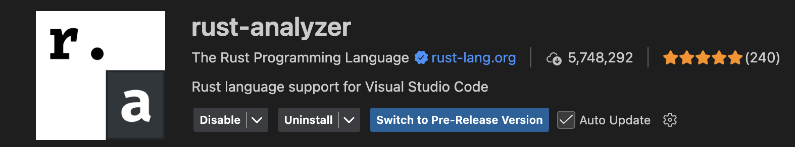

# rust_learning
[Udemy "The Complete Rust Programming Course"](https://sparknz.udemy.com/course/rust-programming-the-complete-guide/learn/lecture/30253516#overview)

# Extension

# Helpful Commands
- Install
    - Macos : curl --proto '=https' --tlsv1.3 https://sh.rustup.rs -sSf | sh
- Get version : 
    - rustc --version
    - cargo --version
- Update version :
    - rustup update
- Compile : rustc main.rs
- Cargo : 
    - Create : cargo new hello_cargo
    - Build only : cargo build
    - Buiold & Run : cargo run